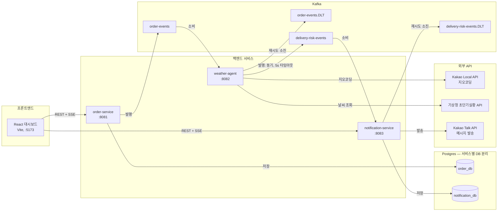
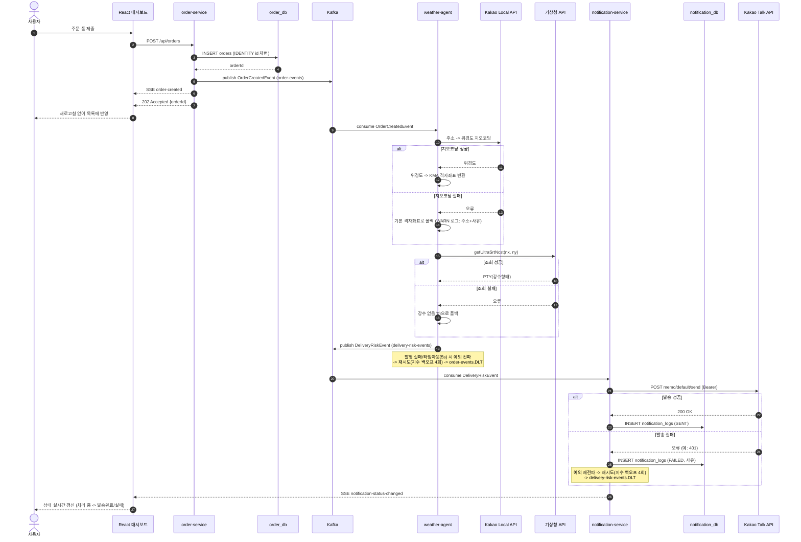

# Delivery Platform

An event-driven delivery workflow built with Spring Boot and Kafka.

## 아키텍처

서비스, Kafka 토픽, DB, 외부 API, 프론트엔드 사이의 관계. `.DLT`(Dead Letter Topic)는 컨슈머가 재시도(지수 백오프 4회)를 다 써도 처리하지 못한 메시지가 유실되지 않고 도착하는 곳이다.

## 시퀀스 다이어그램

주문 접수부터 카카오톡 발송, 프론트엔드 실시간 반영까지 전체 흐름. 각 단계의 실패 처리(지오코딩/날씨 조회 폴백, 발행/발송 실패 시 재시도·DLQ)도 함께 표시했다 — 전부 실제로 구현되어 있고 로그/DB로 검증한 경로다.

## Local run

1. Start Kafka and Postgres with `docker compose up -d`. Postgres init creates two databases (`order_db`, `notification_db`) — one per service, per the database-per-service principle.
2. Set the required environment variables. Copy `.env.example` as a reference; Spring Boot does not load `.env` automatically.
3. Start each service with `./gradlew bootRun` from its module, or run the relevant Spring Boot application from your IDE. Each service runs its own Flyway migrations against its own database on startup.

`KAKAO_API_TOKEN` is required only when the notification service sends real Kakao messages. `KMA_SERVICE_KEY` is required only when weather-agent should look up live weather from the KMA 초단기실황(getUltraSrtNcst) API; without it, weather-agent falls back to a no-precipitation default. `KAKAO_REST_API_KEY` (a separate value from `KAKAO_API_TOKEN` — the app's REST API key, not a user OAuth token) lets weather-agent geocode the order's delivery address to a KMA grid cell via the Kakao Local API; without it, weather-agent falls back to a fixed grid coordinate (`KMA_GRID_NX`/`KMA_GRID_NY`, defaulting to a Seoul reference point). Never commit API keys, tokens, heap dumps, or local `.env` files.

## Dashboard (frontend)

`frontend/` is a React + TypeScript (Vite) dashboard: order list with live delivery risk/notification status, and a form to submit new orders. It talks to order-service and notification-service directly (no BFF/gateway) — each service owns a small read API plus an SSE stream for the events it originates:

- order-service: `GET /api/orders` (list), `GET /api/orders/stream` (SSE `order-created`, pushed the moment an order is saved)
- notification-service: `GET /api/notifications/latest` (latest attempt per order), `GET /api/notifications/stream` (SSE `notification-status-changed`, pushed the moment an outcome is recorded)

The frontend joins the two REST responses and merges both SSE streams client-side by `orderId`. Both services need `FRONTEND_ORIGIN` set (defaults to `http://localhost:5173`) for CORS.

Run it with `cd frontend && npm install && npm run dev`.

## Event contracts

Event payloads and topic names live in `common-module`. This keeps Kafka producers and consumers on the same schema and avoids fragile `Map<String, Object>` parsing.

## Persistence

order-service persists each accepted order (`orders` table) and notification-service persists one row per delivery attempt (`notification_logs` table, including retries — a message that fails then succeeds leaves both rows). Each service owns its own Postgres database; neither reads the other's tables. Schema is managed with Flyway migrations under `src/main/resources/db/migration`.

## Known limitations / follow-up work

- **No transactional outbox.** order-service saves the order to Postgres and then publishes `OrderCreatedEvent` to Kafka as two separate steps, not one atomic operation. If the process crashes between the two, the order exists in the database but the event never fires. A full fix needs an outbox table plus a poller/CDC process (e.g. Debezium) publishing from it — deliberately left out of this pass to keep scope bounded.
- **order-service's Kafka publish is still fire-and-forget.** `OrderProducer.sendOrderCreatedEvent` does not wait for the broker acknowledgment before the API returns 202, so a publish failure after a successful DB save is not reflected in the HTTP response. (weather-agent's equivalent publish to `delivery-risk-events` was already made synchronous with a timeout — see `DeliveryRiskProducer` — as part of the DLQ work; the same treatment for order-service was deferred to avoid changing the order API's response latency/contract without a separate decision.)

## 트러블슈팅

개발하면서 실제로 겪고 고친 문제들이다. 전부 로그, DB 조회, 직접 API 호출로 재현·검증한 것들이고, 짐작만으로 넘어간 건 없다.

### 1. weather-agent producer 직렬화 설정 누락

- **증상**: weather-agent가 `DeliveryRiskEvent`를 발행하려 할 때마다 `SerializationException`이 발생하고, `delivery-risk-events`로 메시지가 나가지 않았다.
- **원인**: `application.yml`에 Kafka consumer 설정만 있고 producer의 key/value serializer가 빠져 있어서, Spring Boot 기본값(`StringSerializer`)이 객체 타입인 `DeliveryRiskEvent`를 직렬화하려다 실패하고 있었다.
- **해결**: producer 설정에 `JsonSerializer`를 명시. 이 버그가 "재시도 소진 시 메시지가 조용히 사라진다"는 걸 직접 겪게 만든 계기가 됐고, 이후 Kafka DLQ 작업 전체로 이어졌다.

### 2. `${KAKAO_API_TOKEN}` 플레이스홀더가 조용히 문자열로 바인딩되는 버그

- **증상**: `KAKAO_API_TOKEN` 환경변수를 아예 설정하지 않아도 notification-service가 에러 없이 정상 기동됐다. 문제는 실제로 카카오 API를 호출하는 시점에야 401로 드러났다.
- **원인**: `@Value`와 달리 `@ConfigurationProperties` 바인딩은 값을 못 찾은 플레이스홀더를 예외 없이 리터럴 문자열 `"${KAKAO_API_TOKEN}"` 그대로 바인딩한다. 이 문자열은 공백이 아니라서 `@NotBlank` 검증도 통과해버린다. 값을 출력하지 않는 임시 진단 테스트로 실제 바인딩된 문자열의 길이(18자, 정확히 저 리터럴과 일치)를 확인해서 원인을 특정했다.
- **해결**: `${KAKAO_API_TOKEN:}`로 빈 문자열 기본값을 명시. 이제 토큰이 없으면 `@NotBlank`가 기동 시점에 정확히 실패한다(fail-fast) — 나중에서야 발견하는 게 아니라.

### 3. 액세스 토큰이 IP를 등록한 앱과 다른 앱 소속이었던 문제

- **증상**: 카카오 개발자 콘솔에서 발신 IP를 허용 목록에 등록했는데도 `ip mismatched` 401이 계속 재현됐다. 10분을 기다려도, IP를 다시 확인해도 그대로였다.
- **원인**: 일부러 잘못된(존재하지 않는) 토큰으로 같은 API를 호출해봤더니 다른 에러(`this access token does not exist`)가 났다. 즉 실제로 쓰던 토큰은 카카오가 "존재하는 진짜 토큰"으로는 인식하는데, IP를 등록한 앱과는 다른 앱에서 발급된 토큰이었던 것이다.
- **해결**: IP를 등록한 그 앱 기준으로 인가 코드 -> 액세스 토큰 교환을 다시 수행. 새 토큰으로 즉시 카카오톡 발송이 성공했다.

### 4. 주문 ID가 재시작마다 초기화되는 버그

- **증상**: order-service를 재시작하면 항상 주문 ID가 1001부터 다시 시작됐다. DB에 실제로 영구 저장을 시작한 뒤부터는, 재시작할 때마다 이전에 저장된 주문이 에러 없이 조용히 덮어써졌다.
- **원인**: `OrderIdGenerator`가 메모리 기반 `AtomicLong`이라 프로세스를 재시작하면 리셋됐다. Spring Data JPA는 저장하려는 엔티티의 `@Id`가 이미 채워져 있으면 insert가 아니라 merge(update)로 처리하기 때문에, 겹치는 ID로 저장할 때마다 이전 행이 그대로 덮어써졌다.
- **해결**: ID를 애플리케이션이 아니라 Postgres IDENTITY 컬럼이 생성하도록 전환. order-service를 두 번 재시작하며 주문을 연달아 만들어 `10001 -> 10002 -> (재시작) -> 10003`으로 끊김 없이 이어지는 것을 DB에서 직접 확인했다.

### 5. DLQ 복구 로직 자체가 무한 재시도에 빠진 버그

- **증상**: Kafka DLQ를 붙이고 나서 검증차 깨진 메시지 하나를 넣었더니, notification-service 로그가 2분도 안 돼서 88만 바이트까지 쌓였다.
- **원인**: notification-service의 `application.yml`에는 Kafka consumer 설정만 있고 producer 설정이 아예 없었다. DLQ 복구용 `DeadLetterPublishingRecoverer`가 내부적으로 쓰는 `KafkaTemplate`이 기본값인 `StringSerializer`로 떨어졌고, 복구 대상인 원본 raw `byte[]`를 String으로 캐스팅하려다 `ClassCastException`이 나서 **복구 자체가 실패**했다. 복구가 실패하니 Kafka는 같은 메시지를 계속 같은 자리로 되돌려서 무한 루프에 빠졌다 — DLQ를 만든 게 오히려 새로운 무한루프 버그를 만든 셈이었다.
- **해결**: order-service/weather-agent와 동일하게 producer에 `JsonSerializer`를 명시. 고친 뒤 다시 깨진 메시지를 Kafka에 직접 발행해서, 이번엔 재시도 4회 후 `.DLT` 토픽에 원본 페이로드 그대로 도착하는 것까지 확인했다.

### (환경) Windows의 Docker Desktop과 Testcontainers 비호환

- **증상**: `@Testcontainers`로 Postgres 컨테이너를 띄우려 하면 `Could not find a valid Docker environment`로 실패. `docker` CLI 자체는 멀쩡히 동작하는데도 그랬다.
- **원인**: Testcontainers의 Java Docker 클라이언트가 Windows named pipe로 붙을 때, 이 머신의 Docker Desktop이 손상된(대부분 필드가 비어있는) 응답을 반환했다. `DOCKER_HOST`를 다른 named pipe로 명시해도, Testcontainers를 최신 버전으로 올려도 동일한 문제가 재현됐다.
- **해결**: 근본 원인이 이 환경의 Docker Desktop 쪽에 있다고 판단하고, Testcontainers의 컨테이너 자동 관리 대신 docker-compose가 이미 띄운 실제 Postgres에 테스트가 직접 접속하도록 전환했다. `@DataJpaTest`의 기본 트랜잭션 롤백으로 테스트 간 격리는 그대로 유지된다.
