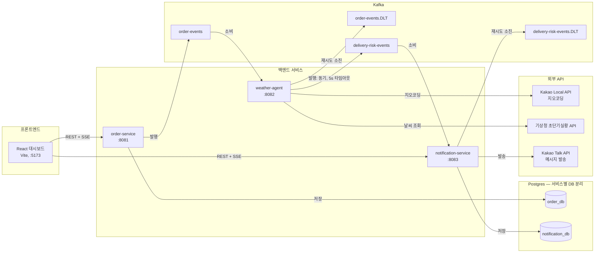
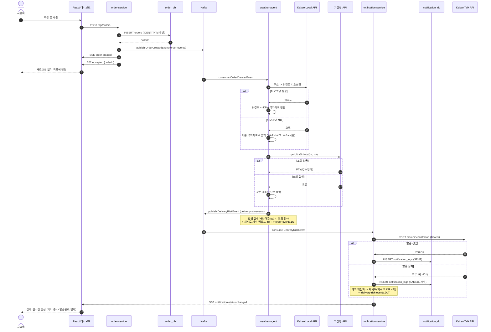
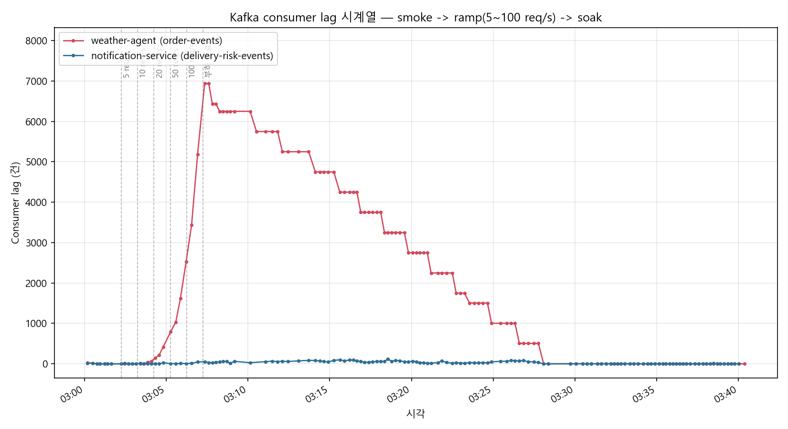

# Delivery Platform

An event-driven delivery workflow built with Spring Boot and Kafka.

## 아키텍처

서비스, Kafka 토픽, DB, 외부 API, 프론트엔드 사이의 관계. `.DLT`(Dead Letter Topic)는 컨슈머가 재시도(지수 백오프 4회)를 다 써도 처리하지 못한 메시지가 유실되지 않고 도착하는 곳이다.

## 시퀀스 다이어그램

주문 접수부터 카카오톡 발송, 프론트엔드 실시간 반영까지 전체 흐름. 각 단계의 실패 처리(지오코딩/날씨 조회 폴백, 발행/발송 실패 시 재시도·DLQ)도 함께 표시했다 — 전부 실제로 구현되어 있고 로그/DB로 검증한 경로다.

## Local run

1. Start Kafka and Postgres with `docker compose up -d`. Postgres init creates two databases (`order_db`, `notification_db`) — one per service, per the database-per-service principle.
2. Set the required environment variables. Copy `.env.example` as a reference; Spring Boot does not load `.env` automatically.
3. Start each service with `./gradlew bootRun` from its module, or run the relevant Spring Boot application from your IDE. Each service runs its own Flyway migrations against its own database on startup.

`KAKAO_API_TOKEN` is required only when the notification service sends real Kakao messages. `KMA_SERVICE_KEY` is required only when weather-agent should look up live weather from the KMA 초단기실황(getUltraSrtNcst) API; without it, weather-agent falls back to a no-precipitation default. `KAKAO_REST_API_KEY` (a separate value from `KAKAO_API_TOKEN` — the app's REST API key, not a user OAuth token) lets weather-agent geocode the order's delivery address to a KMA grid cell via the Kakao Local API; without it, weather-agent falls back to a fixed grid coordinate (`KMA_GRID_NX`/`KMA_GRID_NY`, defaulting to a Seoul reference point). Never commit API keys, tokens, heap dumps, or local `.env` files.

## Dashboard (frontend)

`frontend/` is a React + TypeScript (Vite) dashboard: order list with live delivery risk/notification status, and a form to submit new orders. It talks to order-service and notification-service directly (no BFF/gateway) — each service owns a small read API plus an SSE stream for the events it originates:

- order-service: `GET /api/orders` (list), `GET /api/orders/stream` (SSE `order-created`, pushed the moment an order is saved)
- notification-service: `GET /api/notifications/latest` (latest attempt per order), `GET /api/notifications/stream` (SSE `notification-status-changed`, pushed the moment an outcome is recorded)

The frontend joins the two REST responses and merges both SSE streams client-side by `orderId`. Both services need `FRONTEND_ORIGIN` set (defaults to `http://localhost:5173`) for CORS.

Run it with `cd frontend && npm install && npm run dev`.

## Event contracts

Event payloads and topic names live in `common-module`. This keeps Kafka producers and consumers on the same schema and avoids fragile `Map<String, Object>` parsing.

## Persistence

order-service persists each accepted order (`orders` table) and notification-service persists one row per delivery attempt (`notification_logs` table, including retries — a message that fails then succeeds leaves both rows). Each service owns its own Postgres database; neither reads the other's tables. Schema is managed with Flyway migrations under `src/main/resources/db/migration`.

## Known limitations / follow-up work

- **No transactional outbox.** order-service saves the order to Postgres and then publishes `OrderCreatedEvent` to Kafka as two separate steps, not one atomic operation. If the process crashes between the two, the order exists in the database but the event never fires. A full fix needs an outbox table plus a poller/CDC process (e.g. Debezium) publishing from it — deliberately left out of this pass to keep scope bounded.
- **order-service's Kafka publish is still fire-and-forget.** `OrderProducer.sendOrderCreatedEvent` does not wait for the broker acknowledgment before the API returns 202, so a publish failure after a successful DB save is not reflected in the HTTP response. (weather-agent's equivalent publish to `delivery-risk-events` was already made synchronous with a timeout — see `DeliveryRiskProducer` — as part of the DLQ work; the same treatment for order-service was deferred to avoid changing the order API's response latency/contract without a separate decision.)

## 부하테스트

`loadtest/` 디렉터리에 k6 스크립트와 결과가 있다. 카카오/기상청 실제 API를 호출하지 않도록 `loadtest` Spring 프로파일로 stub을 붙여서(각 서비스의 `application-loadtest.yml`), 외부 API 지연이 섞이지 않은 순수한 이 시스템 자체의 처리 능력과 장애 복구 동작만 측정했다.

### 방법론

k6로 스모크(정상성 확인) → 램프(한계 탐색) → 소크(지속 안정성 확인) 3단계로 진행했고, 별도로 실패율을 인위적으로 높인 짧은 회차를 추가해 DLQ 유입까지 직접 관찰했다.

| 단계 | 부하 | 결과 |
|---|---|---|
| Smoke | 5 req/s × 30초 | 146건, 실패율 0%. p95=1.98s는 커넥션풀/JIT 워밍업 콜드스타트 때문(median 29.6ms는 정상) |
| Ramp | 5→10→20→50→100 req/s, 단계당 1분 | 8,228건, HTTP 실패율 0% — order-service는 DB 저장 + Kafka publish 후 바로 응답하므로 다운스트림 지연과 무관하게 항상 빠르다 |
| Soak | 4 req/s × 10분 | 2,401건, 실패율 0%, p95=57.6ms — 안정 상태 |

### weather-agent 병목 확인

Kafka consumer lag을 2~3초 간격으로 폴링해 시계열로 남겼다(`loadtest/results/lag_scenario_a.csv`). weather-agent는 지오코딩(시뮬레이션 60ms) + 기상 조회(시뮬레이션 80ms)를 순차 호출하므로 이론적 처리 상한을 1000ms / 140ms ≈ **7.14 req/s**로 예상했다.

실측 결과, lag는 **5 req/s에서는 0~2건으로 안정**, **10 req/s부터 꾸준히 증가**해 100 req/s 도달 시 최대 **6,938건**까지 쌓였다 — 예상한 ~7 req/s 근방에서 정확히 변곡점이 나타났다. 부하 종료 후 신규 유입 없이 이 backlog를 소진하는 데 20분 44초가 걸렸고, 이를 역산한 실측 처리량은 **약 5.6 req/s**로 이론치보다 다소 낮았다 (JSON 역직렬화, Kafka poll, DB insert 등 시뮬레이션에 포함하지 않은 실제 오버헤드 때문으로 추정). notification-service는 이 흐름에 종속적으로만 메시지를 받기 때문에 lag가 항상 두 자릿수 이하였다 — 병목은 명확히 weather-agent 한 곳이었다.

*(빨강: weather-agent가 소비하는 `order-events`, 파랑: notification-service가 소비하는 `delivery-risk-events`. 원본 시계열은 `loadtest/results/lag_scenario_a.csv`, 그래프 생성 스크립트는 `loadtest/scripts/plot_lag.py`.)*

### 트러블슈팅: 파티션 1개로 인한 Head-of-Line Blocking

- **증상**: 재시도/DLQ 경로를 실제로 확인하려고 notification-service를 `loadtest.kakao.failure-rate=0.7`(70%)로 재기동해서 5 req/s로 단 2분(600건)만 짧게 부었다. 부하 자체는 2분 만에 끝났는데, notification-group의 consumer lag가 실제로 0으로 돌아오기까지는 **약 28분**이 걸렸다(부하 종료 시점 lag 피크 548건 기준). 같은 시간 동안 weather-group(order-events) lag는 계속 0~2건으로 평온했다 — 실패를 주입하지 않은 쪽은 전혀 영향을 받지 않았다는 뜻이다.
- **원인**: `delivery-risk-events` 토픽도 파티션이 1개라 컨슈머 동시성이 1로 고정된다. 지수 백오프(500ms → 1s → 2s → 4s, 최대 4회 재시도)로 DLQ까지 가는 메시지 하나가 최대 7.5초를 잡아먹는데, 파티션이 1개뿐이라 그 뒤에 대기 중인 **다른 정상 메시지까지 전부 순서대로 막힌다**. 이번 회차에서 600건 중 100건(16.6%)이 실제로 DLQ까지 갔으니, 이 100건만으로도 순수 백오프 대기 시간이 100 × 7.5s = 750초(12.5분)이고, 여기에 1~4회 만에 성공한 나머지 메시지들의 재시도 대기까지 겹쳐 총 회복 시간이 28분까지 늘어난 것으로 보인다.
- **실측 vs 이론**: 순진하게 생각하면 "2분짜리 버스트니까 금방 끝나겠지"라고 예상하기 쉽지만, 재시도 정책과 파티션 동시성이 상호작용하면서 실제 영향 범위는 부하 지속 시간의 약 14배(2분 → 28분)로 늘어났다. 짧은 실패 스파이크의 blast radius를 예측하려면 재시도 백오프 총량과 파티션 동시성을 함께 고려해야 한다는 걸 수치로 확인했다.
- **향후 개선 과제**: `delivery-risk-events`(및 `order-events`) 파티션 수를 늘려 컨슈머 동시성을 확보하면 이 head-of-line blocking이 완화될 것으로 예상되지만, 이번 부하테스트 스코프에서는 실제로 파티션을 늘려 재검증하는 것까지는 하지 않았다. 파티션 증설 시에는 파티션 키 설계(현재는 키 없이 라운드로빈 분배)와 주문별 이벤트 순서 보장이 필요한지 여부도 함께 재검토해야 해서, 검증을 포함해 별도 작업으로 남겨둔다.

### DLQ 유입 검증

- **정상 실패율(5%)**: 8,866건 중 6건(0.07%)만 DLQ에 도달 — 재시도가 99.93%를 흡수했다.
- **의도적으로 높인 실패율(70%)**: 600건 중 100건(16.6%)이 DLQ에 도달했다. 이론값 0.7⁵ ≈ 16.8%(5회 시도가 모두 실패할 확률)와 거의 정확히 일치해서, 재시도 설계가 예측 가능하게 동작한다는 걸 확인했다.

### 산출물

- `loadtest/k6/{smoke,ramp,soak,dlq-check}.js` — k6 시나리오
- `loadtest/scripts/{poll-lag.sh,dlt-offsets.sh}` — consumer lag 시계열 수집, DLQ 오프셋 델타 측정
- `loadtest/results/lag_scenario_a.csv`, `lag_scenario_b.csv` — consumer lag 시계열 원본 데이터
- `loadtest/results/*_summary.json` — k6 자체 집계 통계

## 트러블슈팅

개발하면서 실제로 겪고 고친 문제들이다. 전부 로그, DB 조회, 직접 API 호출로 재현·검증한 것들이고, 짐작만으로 넘어간 건 없다.

### 1. weather-agent producer 직렬화 설정 누락

- **증상**: weather-agent가 `DeliveryRiskEvent`를 발행하려 할 때마다 `SerializationException`이 발생하고, `delivery-risk-events`로 메시지가 나가지 않았다.
- **원인**: `application.yml`에 Kafka consumer 설정만 있고 producer의 key/value serializer가 빠져 있어서, Spring Boot 기본값(`StringSerializer`)이 객체 타입인 `DeliveryRiskEvent`를 직렬화하려다 실패하고 있었다.
- **해결**: producer 설정에 `JsonSerializer`를 명시. 이 버그가 "재시도 소진 시 메시지가 조용히 사라진다"는 걸 직접 겪게 만든 계기가 됐고, 이후 Kafka DLQ 작업 전체로 이어졌다.

### 2. `${KAKAO_API_TOKEN}` 플레이스홀더가 조용히 문자열로 바인딩되는 버그

- **증상**: `KAKAO_API_TOKEN` 환경변수를 아예 설정하지 않아도 notification-service가 에러 없이 정상 기동됐다. 문제는 실제로 카카오 API를 호출하는 시점에야 401로 드러났다.
- **원인**: `@Value`와 달리 `@ConfigurationProperties` 바인딩은 값을 못 찾은 플레이스홀더를 예외 없이 리터럴 문자열 `"${KAKAO_API_TOKEN}"` 그대로 바인딩한다. 이 문자열은 공백이 아니라서 `@NotBlank` 검증도 통과해버린다. 값을 출력하지 않는 임시 진단 테스트로 실제 바인딩된 문자열의 길이(18자, 정확히 저 리터럴과 일치)를 확인해서 원인을 특정했다.
- **해결**: `${KAKAO_API_TOKEN:}`로 빈 문자열 기본값을 명시. 이제 토큰이 없으면 `@NotBlank`가 기동 시점에 정확히 실패한다(fail-fast) — 나중에서야 발견하는 게 아니라.

### 3. 액세스 토큰이 IP를 등록한 앱과 다른 앱 소속이었던 문제

- **증상**: 카카오 개발자 콘솔에서 발신 IP를 허용 목록에 등록했는데도 `ip mismatched` 401이 계속 재현됐다. 10분을 기다려도, IP를 다시 확인해도 그대로였다.
- **원인**: 일부러 잘못된(존재하지 않는) 토큰으로 같은 API를 호출해봤더니 다른 에러(`this access token does not exist`)가 났다. 즉 실제로 쓰던 토큰은 카카오가 "존재하는 진짜 토큰"으로는 인식하는데, IP를 등록한 앱과는 다른 앱에서 발급된 토큰이었던 것이다.
- **해결**: IP를 등록한 그 앱 기준으로 인가 코드 -> 액세스 토큰 교환을 다시 수행. 새 토큰으로 즉시 카카오톡 발송이 성공했다.

### 4. 주문 ID가 재시작마다 초기화되는 버그

- **증상**: order-service를 재시작하면 항상 주문 ID가 1001부터 다시 시작됐다. DB에 실제로 영구 저장을 시작한 뒤부터는, 재시작할 때마다 이전에 저장된 주문이 에러 없이 조용히 덮어써졌다.
- **원인**: `OrderIdGenerator`가 메모리 기반 `AtomicLong`이라 프로세스를 재시작하면 리셋됐다. Spring Data JPA는 저장하려는 엔티티의 `@Id`가 이미 채워져 있으면 insert가 아니라 merge(update)로 처리하기 때문에, 겹치는 ID로 저장할 때마다 이전 행이 그대로 덮어써졌다.
- **해결**: ID를 애플리케이션이 아니라 Postgres IDENTITY 컬럼이 생성하도록 전환. order-service를 두 번 재시작하며 주문을 연달아 만들어 `10001 -> 10002 -> (재시작) -> 10003`으로 끊김 없이 이어지는 것을 DB에서 직접 확인했다.

### 5. DLQ 복구 로직 자체가 무한 재시도에 빠진 버그

- **증상**: Kafka DLQ를 붙이고 나서 검증차 깨진 메시지 하나를 넣었더니, notification-service 로그가 2분도 안 돼서 88만 바이트까지 쌓였다.
- **원인**: notification-service의 `application.yml`에는 Kafka consumer 설정만 있고 producer 설정이 아예 없었다. DLQ 복구용 `DeadLetterPublishingRecoverer`가 내부적으로 쓰는 `KafkaTemplate`이 기본값인 `StringSerializer`로 떨어졌고, 복구 대상인 원본 raw `byte[]`를 String으로 캐스팅하려다 `ClassCastException`이 나서 **복구 자체가 실패**했다. 복구가 실패하니 Kafka는 같은 메시지를 계속 같은 자리로 되돌려서 무한 루프에 빠졌다 — DLQ를 만든 게 오히려 새로운 무한루프 버그를 만든 셈이었다.
- **해결**: order-service/weather-agent와 동일하게 producer에 `JsonSerializer`를 명시. 고친 뒤 다시 깨진 메시지를 Kafka에 직접 발행해서, 이번엔 재시도 4회 후 `.DLT` 토픽에 원본 페이로드 그대로 도착하는 것까지 확인했다.

### (환경) Windows의 Docker Desktop과 Testcontainers 비호환

- **증상**: `@Testcontainers`로 Postgres 컨테이너를 띄우려 하면 `Could not find a valid Docker environment`로 실패. `docker` CLI 자체는 멀쩡히 동작하는데도 그랬다.
- **원인**: Testcontainers의 Java Docker 클라이언트가 Windows named pipe로 붙을 때, 이 머신의 Docker Desktop이 손상된(대부분 필드가 비어있는) 응답을 반환했다. `DOCKER_HOST`를 다른 named pipe로 명시해도, Testcontainers를 최신 버전으로 올려도 동일한 문제가 재현됐다.
- **해결**: 근본 원인이 이 환경의 Docker Desktop 쪽에 있다고 판단하고, Testcontainers의 컨테이너 자동 관리 대신 docker-compose가 이미 띄운 실제 Postgres에 테스트가 직접 접속하도록 전환했다. `@DataJpaTest`의 기본 트랜잭션 롤백으로 테스트 간 격리는 그대로 유지된다.
